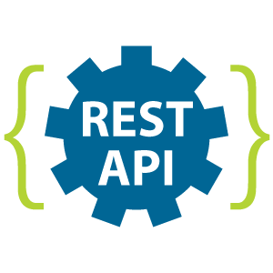

# BackendBootcamp
Three days of  very interresing lessons about apis

# Types of APIs

This documentation provides an overview of different types of APIs commonly used in modern web development.

## REST API (Representational State Transfer)

REST is the most common architectural style for designing networked applications. It uses standard HTTP methods and is stateless.

### Key Characteristics:
- Stateless
- Client-Server Architecture
- Cacheable
- Uniform Interface
- Layered System

### Common HTTP Methods:
- GET: Retrieve data
- POST: Create data
- PUT: Update data
- DELETE: Remove data

## GraphQL

GraphQL is a query language for APIs that allows clients to request exactly the data they need.

### Key Features:
- Single Endpoint
- Client-specified Queries
- Strongly Typed
- Real-time Updates
- Introspective

### Advantages:
- Reduced Over-fetching
- Reduced Under-fetching
- Strong Developer Experience
- Self-documenting

## gRPC

gRPC is a modern, high-performance framework that can run in any environment. It uses Protocol Buffers for serialization.

### Key Features:
- High Performance
- Bi-directional Streaming
- Strongly Typed
- Cross-platform
- Language Agnostic

### Use Cases:
- Microservices
- Real-time Communication
- Low-latency Systems
- Polyglot Systems

## Comparison

| Feature | REST | GraphQL | gRPC |
|---------|------|---------|------|
| Protocol | HTTP | HTTP | HTTP/2 |
| Data Format | JSON | JSON | Protocol Buffers |
| Performance | Good | Better | Best |
| Learning Curve | Low | Medium | High |
| Caching | Easy | Complex | Custom |
| Real-time | No | Yes | Yes |

## When to Use Each

### REST
- Simple CRUD operations
- Public APIs
- When caching is important
- When you need wide compatibility

### GraphQL
- Complex data requirements
- Mobile applications
- When you need to reduce bandwidth
- When you need real-time updates

### gRPC
- Microservices architecture
- High-performance requirements
- Real-time streaming
- Polyglot environments
